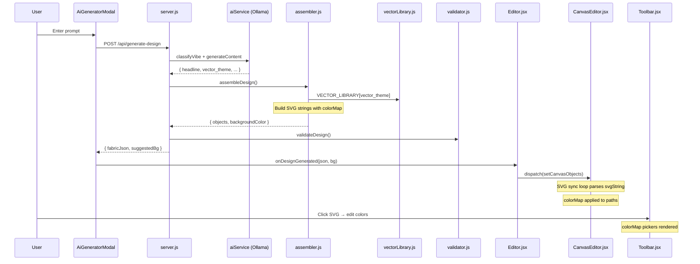

# Pro-Level AI Design: Auto Vector Assets + Multicolor SVG Support

Upgrade the AI design pipeline so it automatically injects professional vector paths (from the new `vectorLibrary.js`) into every generated design — without the user asking — and ensures these SVGs are fully editable with per-color control in the frontend Toolbar.

## User Review Required

> [!IMPORTANT]
> **AI prompt model dependency** — The vector theme selection logic uses the AI's JSON output. The `llama3.1` model via Ollama must be capable of producing a new `"vector_theme"` field. If the model occasionally fails to produce this field, the code gracefully falls back to `minimal_abstract`. Please confirm this is acceptable.

> [!IMPORTANT]
> **Vector scaling** — The paths in `vectorLibrary.js` are designed in a 0–100 coordinate space. They'll be scaled up to fit the canvas using Fabric.js `scaleX`/`scaleY`. This keeps path data clean but means the raw SVG coordinates are small. Let me know if you'd prefer larger base coordinates instead.

## Proposed Changes

### Backend — AI Service (TRYAM AI)

---

#### [MODIFY] [aiService.js](file:///d:/TRYAM%20AI/src/aiService.js)
- Update the system prompt for `generateContent` to instruct the AI to also output a `vector_theme` field: one of `"cyberpunk_tech"`, `"grunge_splatter"`, or `"minimal_abstract"`.
- Parse and return `vector_theme` in the response object with a safe default (`"minimal_abstract"`).

---

#### [MODIFY] [assembler.js](file:///d:/TRYAM%20AI/src/assembler.js)
- Import `VECTOR_LIBRARY` from `vectorLibrary.js`.
- After accent shapes are added, inject **all** vector paths for the AI-chosen `vector_theme`.
- Each vector path becomes an SVG-type object with:
  - `type: "svg"` (matching the existing frontend SVG handler in `CanvasEditor.jsx`)
  - `svgString`: A properly constructed `<svg>` string from the path data.
  - A `colorMap` property mapping the original fill/stroke to palette colors, enabling multicolor editing.
  - Intelligent positioning via the existing `calculateOptimalPositions()` engine.
  - Proper scaling (`scaleX`/`scaleY`) to look good on the canvas.
- The return signature stays `{ objects, backgroundColor }` — no breaking changes.

---

### Backend — Vector Library (TRYAM AI)

#### [EXISTS] [vectorLibrary.js](file:///d:/TRYAM%20AI/src/vectorLibrary.js)
- Already created in the previous step. No changes needed.

---

### Frontend — Canvas Rendering (TRYAM)

#### [MODIFY] [Editor.jsx](file:///d:/TRYAM/src/design-tool/pages/Editor.jsx)
- Update `handleAiObjectsGenerated` to:
  1. Detect SVG-type objects from the AI response (objects with `type === 'svg'`).
  2. Pass through `svgString`, `colorMap`, and positioning props into the Redux state.
  3. Apply the `suggestedBg` canvas background color when present in the response.
- The handler needs to construct the correct Redux object format: `{ id, type: 'svg', svgString, props: { left, top, scaleX, scaleY, colorMap, ... } }`.

---

#### [MODIFY] [AiGeneratorModal.jsx](file:///d:/TRYAM/src/design-tool/components/AiGeneratorModal.jsx)
- Update the response handler to pass `data.suggestedBg` alongside `data.fabricJson` to the `onDesignGenerated` callback.
- Change signature to pass both: `onDesignGenerated(data.fabricJson, data.suggestedBg)`.

---

### Frontend — Color Editing (Already Working!)

The Toolbar and CanvasEditor **already** support multicolor SVG editing:
- **Toolbar.jsx** (lines 844–860): Detects `colorMap` on SVG objects and renders per-color `FillPickerButton` pickers.
- **CanvasEditor.jsx** (lines 694–766): The sync loop already handles `type === 'svg'` objects — parses SVG strings, extracts unique fills/strokes, creates `colorMap`, and applies color remapping.
- **liveUpdateFabric** (lines 329–344): Already handles `colorMap` updates for SVG type.

**No changes needed** to the color editing pipeline — it will work out of the box.

---

## Architecture Flow

## Open Questions

> [!IMPORTANT]
> **Number of vectors per design** — Currently I plan to inject **all paths** from the chosen theme category (2 paths each). Should I cap it at a specific number, or always use all available paths?

## Verification Plan

### Automated Tests
- Start the TRYAM AI server (`node server.js`) and send a test request via `curl` to verify the response includes SVG objects with `svgString` and `colorMap`.
- Verify the frontend compiles without errors (`npm run dev`).

### Manual Verification
- Generate a design from the AI modal and visually confirm:
  1. Vector paths appear on the canvas.
  2. Selecting a vector shows per-color pickers in the Toolbar.
  3. Changing colors updates the vector in real-time.
  4. The suggested background color is applied.
